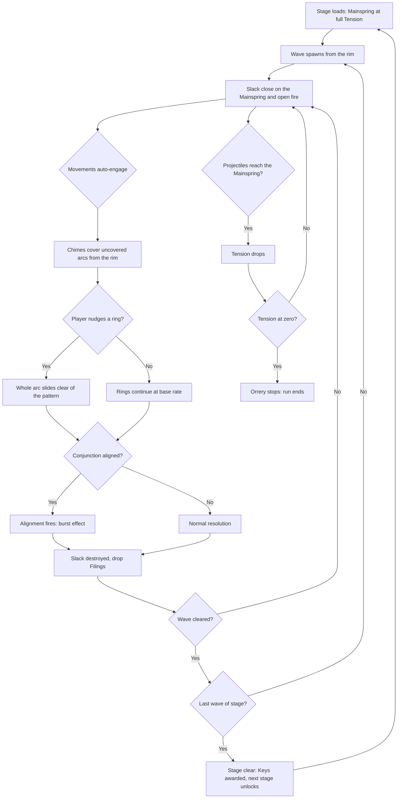
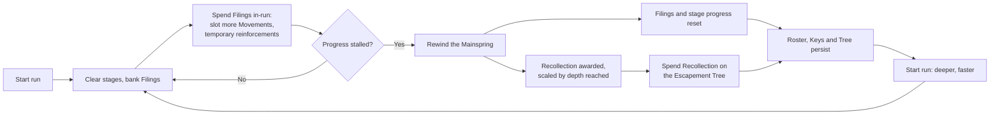

# Core Game Loop

> Phase 3 output. Defines the minute-to-minute and session-to-session loops, and
> win/loss conditions. `systems/scaling.ts` and `core/stageLoader.ts` are built
> against this file.

## Vocabulary

| Term | Means |
|------|-------|
| **Tick** | One simulation step (fixed timestep — see `docs/architecture.md`) |
| **Wave** | One scripted group of Slack, with a spawn schedule |
| **Stage** | A sequence of waves ending in a clear condition |
| **Zone** | A themed run of stages sharing enemies and visual identity |
| **Run** | Play from a Rewinding until the next one |
| **Rewinding** | The prestige act — reset the machine, keep the memory |

## The minute-to-minute loop

**Beat length.** A wave runs 20–40 s. A stage is 5–8 waves, so 3–5 minutes. This
is the unit of attention: a player should be able to put the tab down at any wave
boundary without losing anything.

**Where the decisions are.** Between waves the player re-slots Movements, re-mounts
Chimes, and spends Filings. During a wave the only input is the ring nudge. This is
the auto-battler's commit-then-watch rhythm with one steering lever added (P2, P3).

## The session-to-session loop

**The stall is the signal.** A run ends when the player's power curve flattens
against the wave curve — not on a timer. `systems/scaling.ts` tunes the wave curve
so the first stall lands around 25–40 minutes on a first run, and much sooner
thereafter as the player learns to rewind early and often.

**The offline branch.** Closing the tab does not end a run. The Orrery keeps turning
at base rate; see `systems/offlineProgress.ts` and Phase 27. Offline play accrues
Filings at a capped, diminishing rate and **does not fire conjunctions** — a
deliberate gap that keeps active play meaningfully stronger (P1 says the machine
runs without you; it does not say it runs *as well*).

## Win and loss conditions

### Per wave
- **Clear:** every Slack in the wave destroyed.
- **No loss condition.** Waves cannot be failed independently; damage carries into
  the next wave as reduced Tension.

### Per stage
- **Clear:** final wave cleared with Tension above zero. Awards Keys and unlocks
  the next stage.
- **Loss:** Tension reaches zero. The Orrery stops. The run does not end — the
  player is returned to the stage-select with the stage un-cleared and keeps all
  Filings banked so far. Failure costs *time*, never *progress*.

### Per boss stage
- **Clear:** boss destroyed through all its phases.
- **Loss:** as above, but boss stages additionally reset their wave counter, so a
  retry starts the encounter clean rather than mid-phase.

### Per run
- A run has no failure state. It ends only when the player chooses to Rewind.
  This is load-bearing for P5: the reset must always be the player's decision,
  never something the game does to them.

### Meta goal

Restart the outermost ring. The Orrery has been running down for longer than the
Escapement has existed, and its furthest spheres have been dark for generations.
The stated goal — the thing the last zone delivers — is **turning the Unnumbered
Ring over for the first time in living memory**, which in mechanical terms is the
final zone's clear condition and the end of the authored content.

Progression past that point is open-ended: the wave curve keeps scaling, and
Recollection keeps buying depth. See `economy-spec.md` for the endless-scaling
formula.

## Loop health checks

Questions to re-ask at Phases 10, 20 and 35. If any answer turns to "no", the loop
is broken and content work should stop until it is fixed.

1. Can the player state *why* they lost a stage within five seconds of losing it?
2. Does a wave boundary feel like a safe place to stop?
3. Is the first Rewinding tempting rather than dutiful?
4. Does an arrangement the player set up ever pay off in a way they *see*?
5. Is returning after eight hours away interesting, or just a bigger number?
